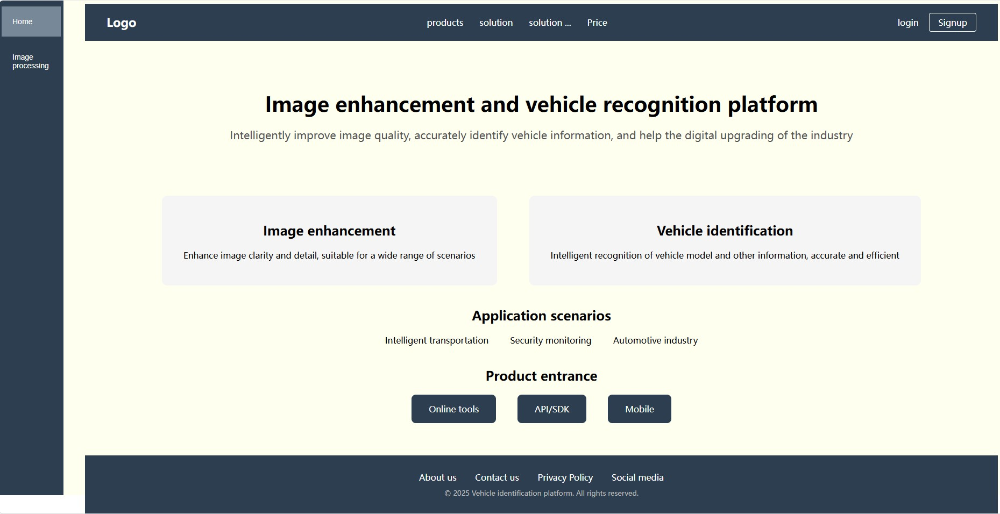
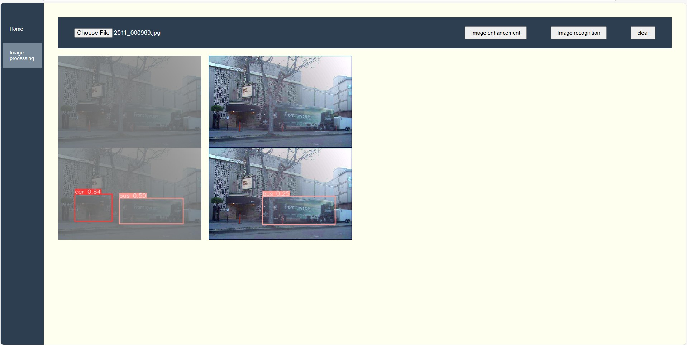

# Dehaze_Vehicle_detection
Local web application for image dehazing and vehicle detection using FFA-Net and YOLOv5s.

## Quick Start

```bash
# 1. Install dependencies
pip install -r requirements.txt

# 2. Run the application
python app.py

# 3. Open the local website
# (usually http://127.0.0.1:5000)

# 4. Upload a foggy picture
# - Click the upload button
# - Choose one picture to upload

# 5. Process the picture
# - Click the "Enhance" button to dehaze
# - Click the "Detect" button to run YOLOv5 detection
```




## Requirements

### Hardware Recommendations
- **GPU**: NVIDIA RTX 3070 or better
- **RAM**: 32GB+
- **CPU**: Modern multi-core processor

### Software Requirements
- **OS**: Windows 11
- **Python**: 3.8
- **CUDA**: 11.8+ or 12.0+
